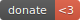

<h1 align="center">nopCommerce CLI - The modern web developer's tool.</h1>

<p align="center">
  
  <br>
  <i>nopCommerce CLI is a development tool for build plugins for nopCommerce Solutions.</i>
  <br>
</p>
 
<p align="center">
  <a href="CONTRIBUTING.md">Contributing Guidelines</a>
  ·
  <a href="https://github.com/DiogenesPolanco/nopCommerce-cli/issues">Submit an Issue</a>
  ·
  <a href="https://blog.nopcli.io/">Blog</a>
  <br>
  <br>
</p>
 
<hr>
  
## Development Setup

### Prerequisites

- Install <a href="https://nodejs.org/es/download/">[node.js] </a>
- Install <a href="https://dotnet.microsoft.com/download">[dotnet core]</a>
- Clone <a href="https://github.com/nopSolutions/nopCommerce">[nopCommerce]</a>

### Setting Up a Plugin of nopCommerce

Install the nopCommerce CLI globally:

```
$ npm install -g nopcli
```

Create plugin:

```
$ nopcli new -g=[GROUP NAME] -p=[PLUGIN NAME]
```

Build the plugin:

```
$ nopcli build -g=[GROUP NAME] -p=[PLUGIN NAME]
```

nopCommerce CLI is cross-platform, fast, scalable, has incredible tooling, and is loved by millions.
<p>
	<a href="https://www.paypal.com/donate/?hosted_button_id=VM4NMF6PY4SMG">
	
	</a>
	<br><br>
	<b>🙌 Use <a href="https://diogenespolanco.com">donations</a> to help support <b>this</b> project! 🙌</b>
	<br> 
	<br> 
	<b>Love nopCommerce CLI? Give our repo a star :star: :arrow_up:.</b>
</p>


